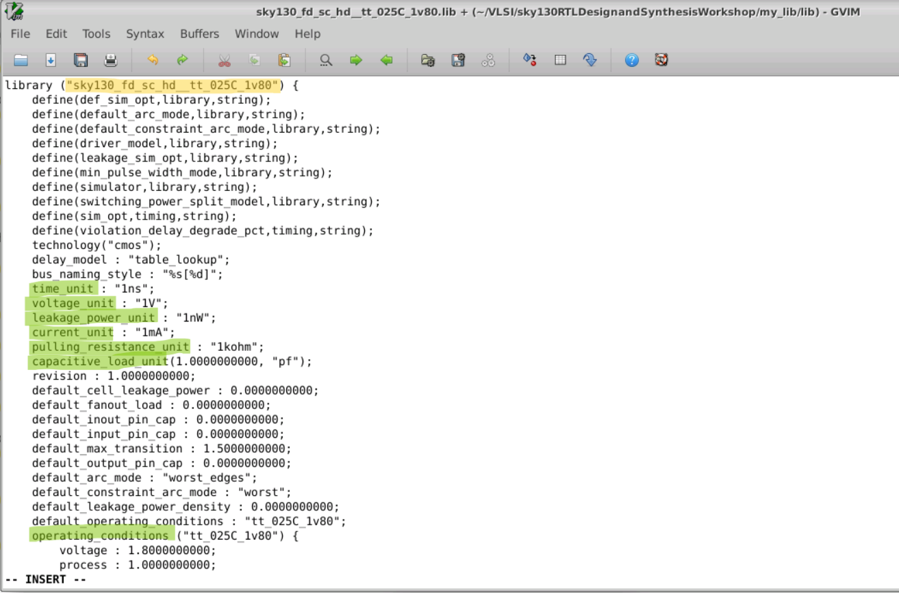

# sky130RTLDesignandSynthesisWorkshop

# About

A cloud based 5 day training workshop which offeres insights into verilog coding techniques for successful elaboration and synthesis using sky130 PDK.

Workshop conducted by VLSI System Design : [VSD website](https://www.vlsisystemdesign.com/)

# Outline

1. [Introduction](#1-Introduction)
2. [Verilog RTL Design and Synthesis](#2-verilog-rtl-and-synthesis) 
    1. [Lab - To create a directory and clone .git files]
    2. [Commands to simulate a RTL design]
    3. [Lab - Simulation]
    4. [Commands to run Synthesis]
    5. [Lab - Synthesis]
3. [Decoding Library File(s)](#3-decoding-library-file(s))
4. [Hierarchial vs Flat Synthesis](#4-hierarchial-vs-flat-synthesis)
5. [Flop Coding Style](#5-flop-coding-style)
6. [Combinational Optimisations](#6-combinational-optimisations)
7. [Sequential Optimisations](#7-sequential-optimisations)
8. [Gate Level Simulation (GLS)](#8-gate-level-simulation-(GLS))
9. [Synthesis - Simulation Mismatch](#9-synthesis-simulation-mismatch)
    1. [Blocking vs Non- Blocking Statements](#9-1-Blocking-vs-Non-Blocking-statements)
10. [Synthesis Optimisation Techniques](#10-synthesis-optimisation-techniques)

# 1. Introduction

Register Transfer Level (RTL) is an abstraction technique for defining the digital portions of a design. It serves as the golden model in the design and verification flow. The RTL design is usually captured using a hardware description language (HDL) such as Verilog or VHDL. When the language is fed into a synthesis tool, abstraction of the design that is used for all downstream implementation operations.

In this workshop, **Verilog** was used as the target HDL language. **iverilog** was used to generate Value Change Dump Files (VCD) and **gtkwave** was used to view the simulation outputs. OpenLANE's synthesis tool **yosys** was used to synthesise the RTL models.

# 2. Verilog RTL and Synthesis

The functional behaviour of any circuit design is verified by simulating the device under test(DUT). Famous simulation tools include LTSpice and NgSpice for analog circuits. ModelSim simulator is widely used to simulate digital circuits. To verify the behaviour of a circuit, test cases pertaining to various use cases should be fed and the corresponding output should be observed and analysed. Simulations often reveal the functionality and the potential pitfalls associated with the design. 

To simulate digital circuits, a test signal can be **forced** on the simulator or a **testbench** can be written to automate the simulation process. *Testbench* applies stimulus(often known as test vectors) to the design. A simulator evaluates output when a change in the input is detected. Any simulator on applying stimulus to the DUT generates a **.vcd** file as output which can be opened using a VCD waveform viewer (gtkwave in this workshop).

| .png) | 
|:--:| 
| Files used throughout the course|

## 2.i Lab 1 - Cloning git files and viewing directory contents

| .png) | 
|:--:| 
| Creating a directory and checking if iverilog and yosys are functional |

| .png) |
|:--:| 
| To clone required .lib and verilog files [Link to Files](https://github.com/kunalg123/sky130RTLDesignAndSynthesisWorkshop)|

| .png) | 
|:--:| 
| To view the files|

## 2.iii Lab 2 - To simulate a counter

| .png) | 
|:--:| 
| Commands for simulating a RTL Model |

| .png) | 
|:--:| 
| GTKWave Window |

## 2.v Lab 3 - To synthesize a RTL design

| .png) | 
|:--:| 
| Launch yosys |

| .png) | 
|:--:| 
| Read the library file, design files and sythesize the top module |

| .png) | 
|:--:| 
| Synthesis Statistics - Displayed on successful synthesis ; Generate netlist |

| .png) | 
|:--:| 
| Netlist Result ; Show command to display synthesised design |

| .png) | 
|:--:| 
| Synthesised Design|

| .png) | 
|:--:| 
| To write netlist with attributes |

| .png) | 
|:--:| 
| Generated Netlist |

| .png) | 
|:--:| 
| To write netlist without attributes |

| .png) | 
|:--:| 
| Generated Netlist |

# 3. Decoding Library Files

## 3.1 Lab 4 - Analysing .lib file

|  | 
|:--:| 
| Highlighted text shows i) File name - process,voltage and operating temperature given ii) Units for various parameters and other required information|

| .png) |
|:--:| 
| Pin Specific Details |

| .png) | 
|:--:| 
| Timing related details|

| .png) | 
|:--:| 
| Same logic unit available in different flavours|

| .png) | 
|:--:| 
| Comparison of area between mux2_2, mux2_4 and mux2_8 respectively - More Area, less delay but increased power consumption|

# 4. Hierarchial vs Flat Synthesis

## 4.1. Lab 5 - Hierarchial Synthesis and flattened design

| .png) | 
|:--:| 
| Synthesis result of a multi-module RTL design|

| .png) | 
|:--:| 
| Generated netlist|

| .png) | 
|:--:| 
| Hierarchial design output |

| .png) | 
|:--:| 
| Flattened Design|

| .png) | 
|:--:| 
| Synthesis of a sub module|

# 5. Flop Coding Style

| .png) | 
|:--:| 
| Synthesis result of a multi-module RTL design|

| .png) | 
|:--:| 
| Generated netlist|

| .png) | 
|:--:| 
| Hierarchial design output |

| .png) | 
|:--:| 
| Flattened Design|

| .png) | 
|:--:| 
| Synthesis of a sub module|

# 6. Combinational Optimisations

# 7. Sequential Optimisations

# 8. Gate Level Simulation (GLS)

# 9. Synthesis - Simulation Mismatch

## 9.i. Blocking vs Non- Blocking Statements

# 10. Synthesis Optimisation Techniques
