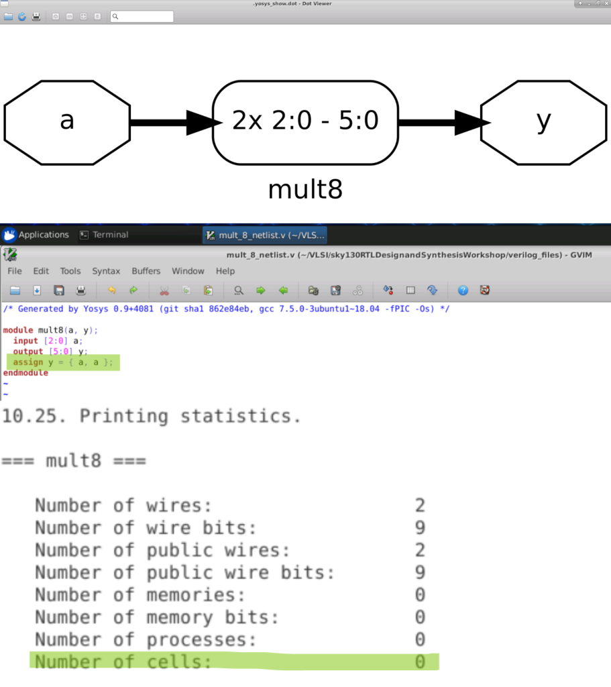
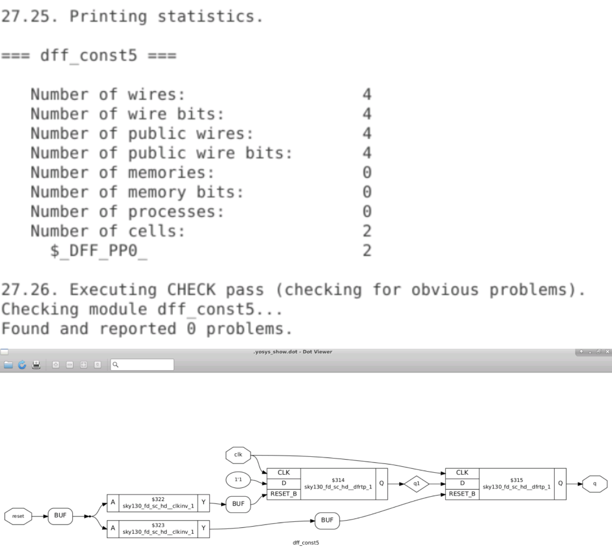
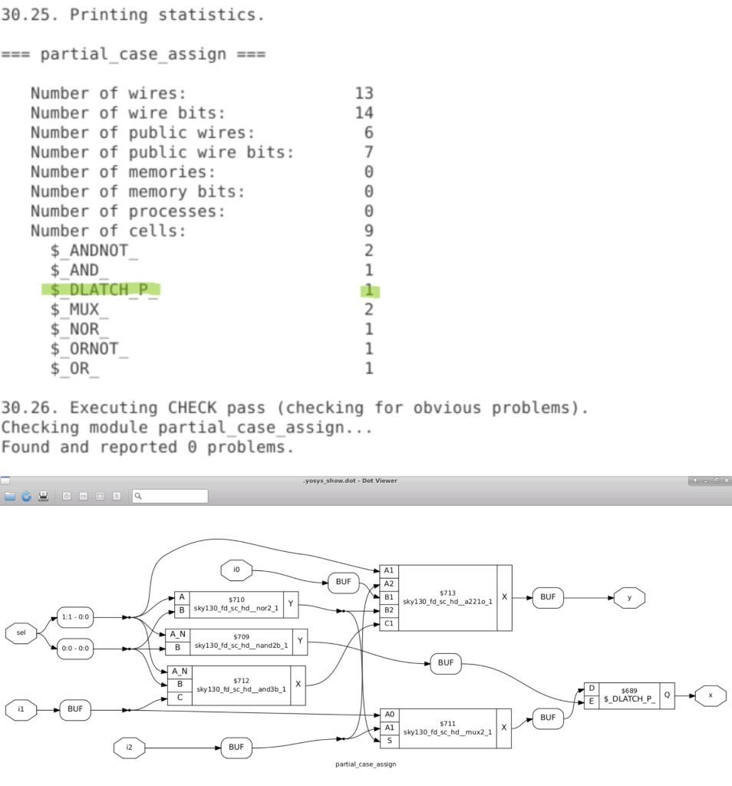

# sky130RTLDesignandSynthesisWorkshop


# About

A cloud based 5 day training workshop which offeres insights into verilog coding techniques for successful elaboration and synthesis using sky130 PDK.

Workshop conducted by VLSI System Design : [VSD website](https://www.vlsisystemdesign.com/)

# Outline

1. [Introduction](#1-Introduction)
2. [Verilog RTL Design and Synthesis](#2-verilog-rtl-and-synthesis) 
    1. [To create a directory and clone .git files](https://github.com/jargonized/sky130RTLDesignandSynthesisWorkshop/blob/main/README.md#2i-lab-1---cloning-git-files-and-viewing-directory-contents)
    2. [Commands to simulate a RTL design]()
    3. [Simulation](https://github.com/jargonized/sky130RTLDesignandSynthesisWorkshop/blob/main/README.md#2iii-lab-2---to-simulate-a-counter)
    4. [Commands to run Synthesis]()
    5. [Synthesis](https://github.com/jargonized/sky130RTLDesignandSynthesisWorkshop/blob/main/README.md#2v-lab-3---to-synthesize-a-rtl-design)
3. [Decoding Library File(s)](#3-decoding-library-file(s))
    1. [Analysing .lib file](https://github.com/jargonized/sky130RTLDesignandSynthesisWorkshop/blob/main/README.md#31-lab-4---analysing-lib-file)
    
4. [Hierarchial vs Flat Synthesis](#4-hierarchial-vs-flat-synthesis)
    1. [Hierrachial and Flattened Design](https://github.com/jargonized/sky130RTLDesignandSynthesisWorkshop/blob/main/README.md#41-lab-5---hierarchial-synthesis-and-flattened-design)
5. [Flop Coding Style](#5-flop-coding-style)
    1. [Flop Models](https://github.com/jargonized/sky130RTLDesignandSynthesisWorkshop/blob/main/README.md#51---lab-6---flop-models)
    2. [Insight into optimisations](https://github.com/jargonized/sky130RTLDesignandSynthesisWorkshop/blob/main/README.md#52---lab-7---interesting-optimisations)
6. [Combinational Optimisations](#6-combinational-optimisations)
    1. [Optimisation of Combinational Logic](https://github.com/jargonized/sky130RTLDesignandSynthesisWorkshop/blob/main/README.md#61-lab-8---optimisation-of-combinational-logic)
    
7. [Sequential Optimisations](#7-sequential-optimisations)
    1. [Optimisation of Sequential Logic](https://github.com/jargonized/sky130RTLDesignandSynthesisWorkshop/blob/main/README.md#71-lab-9---optimisation-of-sequential-logic)
    2. [Counter Optimisation](https://github.com/jargonized/sky130RTLDesignandSynthesisWorkshop/blob/main/README.md#72-lab-9---counter-optimisation)
8. [Gate Level Simulation (GLS)](#8-gate-level-simulation-gls)
    1. [GLS](https://github.com/jargonized/sky130RTLDesignandSynthesisWorkshop/blob/main/README.md#81---lab-10---gate-level-simulation-observation)
9. [Synthesis - Simulation Mismatch](#9-synthesis---simulation-mismatch)
    1. [Blocking vs Non- Blocking Statements](#91---lab-11---mismatch-due-to-blocking-statements)
10. [Synthesis Optimisation Techniques](#10-synthesis-optimisation-techniques)
    1. [Incomplete if](https://github.com/jargonized/sky130RTLDesignandSynthesisWorkshop/blob/main/README.md#101---lab-12---incomplete-if---inferred-latches)
    2. [Incomplete case](https://github.com/jargonized/sky130RTLDesignandSynthesisWorkshop/blob/main/README.md#102---lab-13---incomplete-case---inferred-latches)
    3. [for loop and for generate](https://github.com/jargonized/sky130RTLDesignandSynthesisWorkshop/blob/main/README.md#103---lab-14---for-loop-and-for-generate)
11. [Summary](#11-summary)
12. [Acknowledgement](#12-acknowledgement)
13. [Bibliography](#13-bibliography)

# 1. Introduction

Register Transfer Level (RTL) is an abstraction technique for defining the digital portions of a design. It serves as the golden model in the design and verification flow. The RTL design is usually captured using a hardware description language (HDL) such as Verilog or VHDL. When the language is fed into a synthesis tool, abstraction of the design that is used for all downstream implementation operations.

In this workshop, **Verilog** was used as the target HDL language. **iverilog** was used to generate Value Change Dump Files (VCD) and **gtkwave** was used to view the simulation outputs. OpenLANE's synthesis tool **yosys** was used to synthesise the RTL models.

# 2. Verilog RTL and Synthesis

The functional behaviour of any circuit design is verified by simulating the device under test(DUT). Famous simulation tools include LTSpice and NgSpice for analog circuits. ModelSim simulator is widely used to simulate digital circuits. To verify the behaviour of a circuit, test cases pertaining to various use cases should be fed and the corresponding output should be observed and analysed. Simulations often reveal the functionality and the potential pitfalls associated with the design. 

To simulate digital circuits, a test signal can be **forced** on the simulator or a **testbench** can be written to automate the simulation process. *Testbench* applies stimulus(often known as test vectors) to the design. A simulator evaluates output when a change in the input is detected. Any simulator on applying stimulus to the DUT generates a **.vcd** file as output which can be opened using a VCD waveform viewer (gtkwave in this workshop).

Synthesis is carried out to convert RTL to gate level logic. The gates definitions are provided by the chip manufacturer in the form of .lib file with necessary verilog models of the cells. All basic gates are a part of the .lib file and different flavours(varients) of the same gate are present to account for:
- Fast cells are required to meet setup time criteria (Tclk > TcqA + Tcombi +TsetupB )
- Slow cells are required to meet the hold time criteria (TholdB < TcqA + Tcombi )


Selection of the cells are guided by the constraints provided by the designer.

Below are the RTL files used in the course.

| .png) | 
|:--:| 
| Files used throughout the course|

## 2.1 Lab 1 - Cloning git files and viewing directory contents

First step of this workshop was to import the required files on the remote machine for the files to be avaiable locally. Steps that were acrried out:
- To create a directory (VLSI in my case)
- To clone the required files [Link to Files](https://github.com/kunalg123/sky130RTLDesignAndSynthesisWorkshop)
- To view the cloned files

| .png) | 
|:--:| 
| Creating a directory and checking if iverilog and yosys are functional |

| .png) |
|:--:| 
| To clone required .lib and verilog files |

| .png) | 
|:--:| 
| To view the files|

## 2.2 Commands to simulate a RTL Design

```
$ iverilog module1.v tb_module1.v // to generate a.out file - icnlude all design files for hierarchial design and top module's tb in case of multiple modules
$ ./a.out // to generate .vcd file
$ gtkwave tb_module1.vcd //to view the waveform
// use respective file names
```

## 2.3 Lab 2 - To simulate a counter

| .png) | 
|:--:| 
| Commands for simulating a RTL Model |

| .png) | 
|:--:| 
| GTKWave Window |

## 2.4 Commands to run synthesis

```
$ cd <path where verilog files are stored>
$ yosys // to invoke synthesiser
$ read_liberty -lib <path to lib file> // to read standard cells
$ read_verilog <module files> //to read RTL design(s)
$ synth -top module_name
$ abc -liberty <path to .lib file> // to generate netlist
$ show // to view the synthesised design
$ write_verilog -noattr <filename> //to write netlist as .v file
// use respective file names
```

## 2.5 Lab 3 - To synthesize a RTL design

| .png) | 
|:--:| 
| Launch yosys |

| .png) | 
|:--:| 
| Read the library file, design files and sythesize the top module |

| .png) | 
|:--:| 
| Synthesis Statistics - Displayed on successful synthesis ; Generate netlist |

| .png) | 
|:--:| 
| Netlist Result ; Show command to display synthesised design |

| .png) | 
|:--:| 
| Synthesised Design|

| .png) | 
|:--:| 
| To write netlist with attributes |

| .png) | 
|:--:| 
| Generated Netlist |

| .png) | 
|:--:| 
| To write netlist without attributes |

| .png) | 
|:--:| 
| Generated Netlist |


# 3. Decoding Library Files

Lib file is a short form of Liberty Timing file. Liberty syntax is followed to write a .lib file. LIB file is an ASCII representation of timing and power parameter associated with cells inside the standard cell library of a particular technology node. Lib file is basically a timing model file which contains cell delay, cell transition time, setup and hold time requirement of the cell. So Lib file basically contains timing and electrical characteristics of a cell or macros. Lib file is generated and provided to ASIC designer by a standard cell library vendor or Foundry if the foundry provides a standard cell library. 

The process corner refers to the variation into fabrication parameters used to apply during integrated circuit design to the semiconductor wafer. Inconsistency during design and deviation of voltage and temperature during its operation widens the worst-case margin and significantly degrades the performance. 

Process variations (in CMOS technology) - Slownslowp, FastnFastp, SlownFastp, FastnSlowp, Typical

Best case scenario - Quick process, maximum voltage and lowest temperature.

Worst case scenario - Slow process, low voltage and high temperature.

Standard library cells can be better understood by analysing it's corresponding verilog model.

## 3.1 Lab 4 - Analysing .lib file

|  | 
|:--:| 
| Highlighted text shows i) File name - process,voltage and operating temperature given ii) Units for various parameters and other required information|

| .png) |
|:--:| 
| Pin Specific Details |

| .png) | 
|:--:| 
| Timing related details|

| .png) | 
|:--:| 
| Same logic unit available in different flavours|

| .png) | 
|:--:| 
| Comparison of area between mux2_2, mux2_4 and mux2_8 respectively - More Area, less delay but increased power consumption|


# 4. Hierarchial vs Flat Synthesis

Modularity is used to implement almost all digital circuits today. Dividing a complex circuits into smaller blocks helps in faster implementation, debugging, and optimisation. It also helps us tackle the memory limitations of the hardware used to design the logic. A design can be hierarchial either physically or logically.

## 4.1. Lab 5 - Hierarchial Synthesis and flattened design

A circuit with two sub-modules instantiated in synthesised and analysed below. The output shows the deisgn without elaborating the submodules.

| .png) | 
|:--:| 
| Synthesis result of a multi-module RTL design|

| .png) | 
|:--:| 
| Generated netlist|

| .png) | 
|:--:| 
| Hierarchial design output |

```
$ flatten // used to flatten the design such that even the 
//submodules' gate level implementation can be viewed.

```

| .png) | 
|:--:| 
| Flattened Design|

Any sub module can be synthesised separately. This is advantageous because:
- If the same module is replicated n times, synthesis result can also be replicated.
- Divide and conquer method for massive designs

**Note:** NAND implementation is preferred over NOR because stacking of PMOS demands more width for reasonable logical effort.

[Logical Effort in detail](https://www.cerc.utexas.edu/~jaa/vlsi/lectures/6-1.pdf)

| .png) | 
|:--:| 
| Synthesis of a sub module|

# 5. Flop Coding Style

A glitch is any unwanted pulse at the output of a combinational gate. In other words, a glitch is a small spike that happens at the output of a gate. A glitch happens generally, if the delays to the combinational gate output are not balanced. Cascading combinational logic worsens the glitches observed on outputs. Flops can be deployed to provide shielding between combinational stages thus eliminating the rippling effect of glitches.

Flops are initialised using a set or reset pin. These pins can be synchronous or asynchronous.
- Synchronous - Set or reset on active low/ active high signal sampled at rising/falling edge of the clock.
- Asynchronous - Set or reset on active high/low activity observed on the pin.

A single flop can have both sync and async pins. Set and reset pin when used together in a flop can cause race conditions.

## 5.1 - Lab 6 - Flop models

|  | 
|:--:| 
| Simulation Outputs |

|  | 
|:--:| 
| Simulation Outputs |

**Note:** While synthesising modules that includes flop(s), an additional command is to be executed to include the flop related .lib files. This is because, at times, foundries provide a separate file for flop mapping.

```
$ dfflibmap -liberty <path to lib file> 
//same as .lib file used for abc step in this case
```

|  | 
|:--:| 
| Synthesised Design - Asynchronous Reset vs Synchronous Reset |

## 5.2 - Lab 7 - Interesting Optimisations

| .png) | 
|:--:| 
|Verilog Model of mul2 and mult8|

The above codes show multiplication by 2 and multiplication by 9. But when the modules were synthesised, no multiplier block can be observed. 

Truth Table realisation revealed ax2 in binary is a appended with a zero. ax9 can be written as ax(8+1) which is ax8 + ax1 which can be further reduced as 'a' appended with three zeroes and then 'a' added to it thus giving {a,a}.

|  | 
|:--:| 
| ax2 Multiplier without multiplier cell |

|  | 
|:--:| 
| ax9 Multiplier without multiplier cell |

# 6. Combinational Optimisations

Optimisation is required to squeeze the 

## 6.1 Lab 8 - Optimisation of Combinational Logic

|  | 
|:--:| 
| Optimisation_Check_1 |

|  | 
|:--:| 
| Optimisation_Check_2 |

|  | 
|:--:| 
| Optimisation_Check_3 |


# 7. Sequential Optimisations

## 7.1 Lab 9 - Optimisation of Sequential Logic

|  | 
|:--:| 
| Dff_Opt_1 |

|  | 
|:--:| 
| Dff_Opt_2 |

|  | 
|:--:| 
| Dff_Opt_3 |

|  | 
|:--:| 
| Dff_Opt_4 |

## 7.2 Lab 9 - Counter Optimisation

|  | 
|:--:| 
| Counter 1 Optimisation |

|  | 
|:--:| 
| Counter 2 Optimisation |

# 8. Gate Level Simulation (GLS)

## 8.1 - Lab 10 - Gate level simulation observation

|  | 
|:--:| 
| Good Mux - Top - Behavioural Simulation Bottom - Gate Level Simulation |

|  | 
|:--:| 
| Bad Mux - Top - Behavioural Simulation Bottom - Gate Level Simulation |


# 9. Synthesis - Simulation Mismatch

## 9.1 - Lab 11 - Mismatch due to blocking statements

|  | 
|:--:| 
| Example of Blocking Statement Caveat |


# 10. Synthesis Optimisation Techniques

## 10.1 - Lab 12 - Incomplete if - Inferred Latches

|  | 
|:--:| 
| Case 1 - Incomplete if |

|  | 
|:--:| 
| Case 2 - Incomplete if |

|  | 
|:--:| 
| Behavioural Simulation and  GLS of incomp_if|

|  | 
|:--:| 
| Behavioural Simulation and  GLS of incomp_if2 |\


## 10.2 - Lab 13 - Incomplete case - Inferred Latches

|  | 
|:--:| 
| Case 1 - Incomplete case |

|  | 
|:--:| 
| Case 2 - Complete case |

|  | 
|:--:| 
|  Case 3 - Bad Case case|

|  | 
|:--:| 
|  Case 2 - Partial Assign case |

## 10.3 - Lab 14 - for loop and for generate

|  | 
|:--:| 
| Multiplexer using for generate |

|  | 
|:--:| 
| Demultiplexer using case statement |

|  | 
|:--:| 
| Demultiplexer using for generate |

|  | 
|:--:| 
|  Ripple Carry Adder using full adder |


# 11. Summary

The outcomes of this workshop are as follows:
 - Introduction to open source simulation tools
 - Introduction to sky130 nm PDK
 - Simulation of RTL models using iverilog and gtkwave
 - Understanding the nuances behind synthesis
 - Synthesis of RTL models using yosys
 - Understnading standard library cells
 - Design of combinational logic using flops 
 - Optimisation of design
 - Gate level simulation and it's importance
 - if, case constructs
 - for loop and for generate constructs

Handwritten notes taken during the 5-day course of th workshop - [Notes](/docs/VSD_RTL_Workshop_Notes.pdf)

# 12. Acknowledgement

The above work was carried out as a part of the 5-day workshop on RTL Design organised by VLSI System Design. I am greatly indebted to Kunal Ghosh (course instructor), Shon Taware (Teaching and Technical Assistant) and the entire VSD Team for this great learning experience and immense guidance provivded throughout the workshop.

# 13. Bibliography

1. [Library Files](https://www.teamvlsi.com/2020/05/lib-and-lef-file-in-asic-design.html)
2. [Glitches](https://vlsiuniverse.blogspot.com/2017/10/glitches-in-combinational-circuits.html)
3. 


