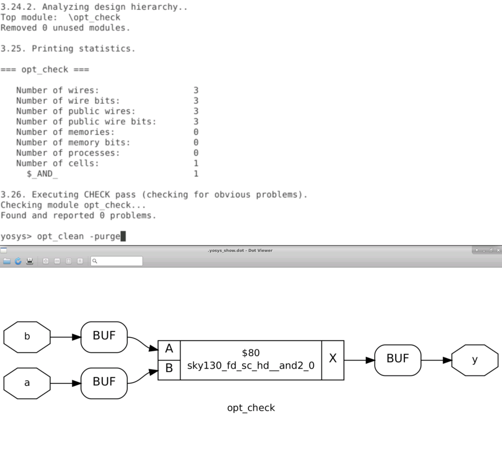

# sky130RTLDesignandSynthesisWorkshop


# About

A cloud based 5 day training workshop which offeres insights into verilog coding techniques for successful elaboration and synthesis using sky130 PDK.

Workshop conducted by VLSI System Design : [VSD website](https://www.vlsisystemdesign.com/)

# Outline

1. [Introduction](#1-introduction)
2. [Verilog RTL Design and Synthesis](#2-verilog-rtl-and-synthesis) 
    1. [To create a directory and clone .git files](https://github.com/jargonized/sky130RTLDesignandSynthesisWorkshop/blob/main/README.md#2i-lab-1---cloning-git-files-and-viewing-directory-contents)
    2. [Commands to simulate a RTL design](#22-commands-to-simulate-a-rtl-design)
    3. [Simulation](https://github.com/jargonized/sky130RTLDesignandSynthesisWorkshop/blob/main/README.md#2iii-lab-2---to-simulate-a-counter)
    4. [Commands to run Synthesis](https://github.com/jargonized/sky130RTLDesignandSynthesisWorkshop#24-commands-to-run-synthesis)
    5. [Synthesis](https://github.com/jargonized/sky130RTLDesignandSynthesisWorkshop/blob/main/README.md#2v-lab-3---to-synthesize-a-rtl-design)
3. [Decoding Library File(s)](https://github.com/jargonized/sky130RTLDesignandSynthesisWorkshop#3-decoding-library-files)
    1. [Analysing .lib file](https://github.com/jargonized/sky130RTLDesignandSynthesisWorkshop/blob/main/README.md#31-lab-4---analysing-lib-file)
    
4. [Hierarchial vs Flat Synthesis](#4-hierarchial-vs-flat-synthesis)
    1. [Hierrachial and Flattened Design](https://github.com/jargonized/sky130RTLDesignandSynthesisWorkshop/blob/main/README.md#41-lab-5---hierarchial-synthesis-and-flattened-design)
5. [Flop Coding Style](#5-flop-coding-style)
    1. [Flop Models](https://github.com/jargonized/sky130RTLDesignandSynthesisWorkshop/blob/main/README.md#51---lab-6---flop-models)
    2. [Insight into optimisations](https://github.com/jargonized/sky130RTLDesignandSynthesisWorkshop/blob/main/README.md#52---lab-7---interesting-optimisations)
6. [Combinational Optimisations](#6-combinational-optimisations)
    1. [Optimisation of Combinational Logic](https://github.com/jargonized/sky130RTLDesignandSynthesisWorkshop/blob/main/README.md#61-lab-8---optimisation-of-combinational-logic)
    
7. [Sequential Optimisations](#7-sequential-optimisations)
    1. [Optimisation of Sequential Logic](https://github.com/jargonized/sky130RTLDesignandSynthesisWorkshop/blob/main/README.md#71-lab-9---optimisation-of-sequential-logic)
    2. [Counter Optimisation](https://github.com/jargonized/sky130RTLDesignandSynthesisWorkshop/blob/main/README.md#72-lab-9---counter-optimisation)
8. [Gate Level Simulation (GLS)](#8-gate-level-simulation-gls)
    1. [GLS](https://github.com/jargonized/sky130RTLDesignandSynthesisWorkshop/blob/main/README.md#81---lab-10---gate-level-simulation-observation)
9. [Synthesis - Simulation Mismatch](#9-synthesis---simulation-mismatch)
    1. [Blocking vs Non- Blocking Statements](#91---lab-11---mismatch-due-to-blocking-statements)
10. [Synthesis Optimisation Techniques](#10-synthesis-optimisation-techniques)
    1. [Incomplete if](https://github.com/jargonized/sky130RTLDesignandSynthesisWorkshop/blob/main/README.md#101---lab-12---incomplete-if---inferred-latches)
    2. [Incomplete case](https://github.com/jargonized/sky130RTLDesignandSynthesisWorkshop/blob/main/README.md#102---lab-13---incomplete-case---inferred-latches)
    3. [for loop and for generate](https://github.com/jargonized/sky130RTLDesignandSynthesisWorkshop/blob/main/README.md#103---lab-14---for-loop-and-for-generate)
11. [Summary](#11-summary)
12. [Acknowledgement](#12-acknowledgement)
13. [Bibliography](#13-bibliography)

# 1. Introduction

Register Transfer Level (RTL) is an abstraction technique for defining the digital portions of a design. It serves as the golden model in the design and verification flow. The RTL design is usually captured using a hardware description language (HDL) such as Verilog or VHDL. When the language is fed into a synthesis tool, abstraction of the design that is used for all downstream implementation operations.

In this workshop, **Verilog** was used as the target HDL language. **iverilog** was used to generate Value Change Dump Files (VCD) and **gtkwave** was used to view the simulation outputs. OpenLANE's synthesis tool **yosys** was used to synthesise the RTL models.

# 2. Verilog RTL and Synthesis

The functional behaviour of any circuit design is verified by simulating the device under test (DUT). Famous simulation tools include LTSpice and NgSpice for analog circuits. ModelSim simulator is widely used to simulate digital circuits. To verify the behaviour of a circuit, test cases pertaining to various use cases should be fed and the corresponding output should be observed and analysed. Simulations often reveal the functionality and the potential pitfalls associated with the design. 

To simulate digital circuits, a test signal can be **forced** on the simulator or a **testbench** can be written to automate the simulation process. *Testbench* applies stimulus(often known as test vectors) to the design. A simulator evaluates output when a change in the input is detected. Any simulator on applying stimulus to the DUT generates a **.vcd** file as output which can be opened using a VCD waveform viewer (gtkwave in this workshop).

Synthesis is carried out to convert RTL to gate level logic. The gates definitions are provided by the chip manufacturer in the form of .lib file with necessary verilog models of the cells. All basic gates are a part of the .lib file and different flavours(varients) of the same gate are present to account for:
- Fast cells are required to meet setup time criteria (Tclk > TcqA + Tcombi +TsetupB )
- Slow cells are required to meet the hold time criteria (TholdB < TcqA + Tcombi )


Selection of the cells are guided by the constraints provided by the designer.

Below are the RTL files used in the course.

| .png) | 
|:--:| 
| Files used throughout the course|

## 2.1 Lab 1 - Cloning git files and viewing directory contents

First step of this workshop was to import the required files on the remote machine for the files to be avaiable locally. Steps that were acrried out:
- To create a directory (VLSI in my case)
- To clone the required files [Link to Files](https://github.com/kunalg123/sky130RTLDesignAndSynthesisWorkshop)
- To view the cloned files

| .png) | 
|:--:| 
| Creating a directory and checking if iverilog and yosys are functional |

| .png) |
|:--:| 
| To clone required .lib and verilog files |

| .png) | 
|:--:| 
| To view the files|

## 2.2 Commands to simulate a RTL Design

```
$ iverilog module1.v tb_module1.v // to generate a.out file - icnlude all design files for hierarchial design and top module's tb in case of multiple modules
$ ./a.out // to generate .vcd file
$ gtkwave tb_module1.vcd //to view the waveform
// use respective file names
```

## 2.3 Lab 2 - To simulate a counter

| .png) | 
|:--:| 
| Commands for simulating a RTL Model |

| .png) | 
|:--:| 
| GTKWave Window |

## 2.4 Commands to run synthesis

```
$ cd <path where verilog files are stored>
$ yosys // to invoke synthesiser
$ read_liberty -lib <path to lib file> // to read standard cells
$ read_verilog <module files> //to read RTL design(s)
$ synth -top module_name
$ abc -liberty <path to .lib file> // to generate netlist
$ show // to view the synthesised design
$ write_verilog -noattr <filename> //to write netlist as .v file
// use respective file names
```

## 2.5 Lab 3 - To synthesize a RTL design

| .png) | 
|:--:| 
| Launch yosys |

| .png) | 
|:--:| 
| Read the library file, design files and sythesize the top module |

| .png) | 
|:--:| 
| Synthesis Statistics - Displayed on successful synthesis ; Generate netlist |

| .png) | 
|:--:| 
| Netlist Result ; Show command to display synthesised design |

| .png) | 
|:--:| 
| Synthesised Design|

| .png) | 
|:--:| 
| To write netlist with attributes |

| .png) | 
|:--:| 
| Generated Netlist |

| .png) | 
|:--:| 
| To write netlist without attributes |

| .png) | 
|:--:| 
| Generated Netlist |


# 3. Decoding Library Files

A .lib file is a short form of Liberty Timing file. Liberty syntax is followed to write a .lib file. LIB file is an ASCII representation of timing and power parameter associated with cells inside the standard cell library of a particular technology node. Lib file is basically a timing model file which contains cell delay, cell transition time, setup and hold time requirement of the cell. So Lib file basically contains timing and electrical characteristics of a cell or macros. Lib file is generated and provided to ASIC designer by a standard cell library vendor or Foundry if the foundry provides a standard cell library. 

The process corner refers to the variation into fabrication parameters used to apply during integrated circuit design to the semiconductor wafer. Inconsistency during design and deviation of voltage and temperature during its operation widens the worst-case margin and significantly degrades the performance. 

Process variations (in CMOS technology) - Slownslowp, FastnFastp, SlownFastp, FastnSlowp, Typical

Best case scenario - Quick process, maximum voltage and lowest temperature.

Worst case scenario - Slow process, low voltage and high temperature.

Standard library cells can be better understood by analysing it's corresponding verilog model.

## 3.1 Lab 4 - Analysing .lib file

|  | 
|:--:| 
| Highlighted text shows i) File name - process,voltage and operating temperature given ii) Units for various parameters and other required information|

| .png) |
|:--:| 
| Pin Specific Details |

| .png) | 
|:--:| 
| Timing related details|

| .png) | 
|:--:| 
| Same logic unit available in different flavours|

| .png) | 
|:--:| 
| Comparison of area between mux2_2, mux2_4 and mux2_8 respectively - More Area, less delay but increased power consumption|


# 4. Hierarchial vs Flat Synthesis

Modularity is used to implement almost all digital circuits today. Dividing a complex circuits into smaller blocks helps in faster implementation, debugging, and optimisation. It also helps us tackle the memory limitations of the hardware used to design the logic. A design can be hierarchial either physically or logically.

## 4.1. Lab 5 - Hierarchial Synthesis and flattened design

A circuit with two sub-modules instantiated in synthesised and analysed below. The output shows the deisgn without elaborating the submodules.

| .png) | 
|:--:| 
| Synthesis result of a multi-module RTL design|

| .png) | 
|:--:| 
| Generated netlist|

| .png) | 
|:--:| 
| Hierarchial design output |

```
$ flatten // used to flatten the design such that even the 
//submodules' gate level implementation can be viewed.

```

| .png) | 
|:--:| 
| Flattened Design|

Any sub module can be synthesised separately. This is advantageous because:
- If the same module is replicated n times, synthesis result can also be replicated.
- Divide and conquer method for massive designs

**Note:** NAND implementation is preferred over NOR because stacking of PMOS demands more width for reasonable logical effort.

[Logical Effort in detail](https://www.cerc.utexas.edu/~jaa/vlsi/lectures/6-1.pdf)

| .png) | 
|:--:| 
| Synthesis of a sub module|

# 5. Flop Coding Style

A glitch is any unwanted pulse at the output of a combinational gate. In other words, a glitch is a small spike that happens at the output of a gate. A glitch happens generally, if the delays to the combinational gate output are not balanced. Cascading combinational logic worsens the glitches observed on outputs. Flops can be deployed to provide shielding between combinational stages thus eliminating the rippling effect of glitches.

Flops are initialised using a set or reset pin. These pins can be synchronous or asynchronous.
- Synchronous - Set or reset on active low/ active high signal sampled at rising/falling edge of the clock.
- Asynchronous - Set or reset on active high/low activity observed on the pin.


A single flop can have both sync and async pins. Set and reset pin when used together in a flop can cause race conditions.

## 5.1 - Lab 6 - Flop models

|  | 
|:--:| 
| Simulation Outputs |

|  | 
|:--:| 
| Simulation Outputs |

**Note:** While synthesising modules that includes flop(s), an additional command is to be executed to include the flop related .lib files. This is because, at times, foundries provide a separate file for flop mapping.

```
$ dfflibmap -liberty <path to lib file> 
//same as .lib file used for abc step in this case
```

|  | 
|:--:| 
| Synthesised Design - Asynchronous Reset vs Synchronous Reset |

## 5.2 - Lab 7 - Interesting Optimisations

| .png) | 
|:--:| 
|Verilog Model of mul2 and mult8|

The above codes show multiplication by 2 and multiplication by 9. But when the modules were synthesised, no multiplier block can be observed. 

Truth Table realisation revealed ax2 in binary is a appended with a zero. ax9 can be written as ax(8+1) which is ax8 + ax1 which can be further reduced as 'a' appended with three zeroes and then 'a' added to it thus giving {a,a}.

|  | 
|:--:| 
| ax2 Multiplier without multiplier cell |

|  | 
|:--:| 
| ax9 Multiplier without multiplier cell |

# 6. Combinational Optimisations

Optimisation is required to squeeze the logic to obtain minimum area and power. Techniques used are:
- Constant Propagation (reducing the logic if constant signals are fed as input)
- Boolean Logic Optimisation (using Boolean Algebra laws)

By default, synthesiser optimises any given logic. Optimisation can be forced by running the following command.

```
$ opt_clean -purge
// to be run after synth cmd
```

## 6.1 Lab 8 - Optimisation of Combinational Logic

```
module opt_check (input a , input b , output y);
	assign y = a?b:0;
endmodule
```
|  | 
|:--:| 
| Optimisation_Check_1 |

```
module opt_check2 (input a , input b , output y);
	assign y = a?1:b;
endmodule

```

|  | 
|:--:| 
| Optimisation_Check_2 |

```
module opt_check3 (input a , input b, input c , output y);
	assign y = a?(c?b:0):0;
endmodule
```

|  | 
|:--:| 
| Optimisation_Check_3 |


# 7. Sequential Optimisations

Techniques used:
- Basic 
    - Sequential Constant Propagation
- Advanced
    - State optimisation (State Reduction)
    - Retiming
    - Sequential Logic Cloning

## 7.1 Lab 9 - Optimisation of Sequential Logic

```
module dff_const1(input clk, input reset, output reg q);
always @(posedge clk, posedge reset)
begin
	if(reset)
		q <= 1'b0;
	else
		q <= 1'b1;
end

endmodule
```

|  | 
|:--:| 
| Dff_Opt_1 |

```
module dff_const2(input clk, input reset, output reg q);
always @(posedge clk, posedge reset)
begin
	if(reset)
		q <= 1'b1;
	else
		q <= 1'b1;
end

endmodule
```

|  | 
|:--:| 
| Dff_Opt_2 |

```
module dff_const4(input clk, input reset, output reg q);
reg q1;

always @(posedge clk, posedge reset)
begin
	if(reset)
	begin
		q <= 1'b1;
		q1 <= 1'b1;
	end
	else
	begin
		q1 <= 1'b1;
		q <= q1;
	end
end

endmodule
```

|  | 
|:--:| 
| Dff_Opt_3 |

```
module dff_const5(input clk, input reset, output reg q);
reg q1;

always @(posedge clk, posedge reset)
begin
	if(reset)
	begin
		q <= 1'b0;
		q1 <= 1'b0;
	end
	else
	begin
		q1 <= 1'b1;
		q <= q1;
	end
end

endmodule
```

|  | 
|:--:| 
| Dff_Opt_4 |

## 7.2 Lab 9 - Counter Optimisation

Though the counter requires three flops, only one flop has been synthesised in the first case(output depends only on Q of first flop) thus optimising the design.

```
module counter_opt (input clk , input reset , output q);
reg [2:0] count;
assign q = count[0];

always @(posedge clk ,posedge reset)
begin
	if(reset)
		count <= 3'b000;
	else
		count <= count + 1;
end

endmodule
```


|  | 
|:--:| 
| Counter 1 Optimisation |

```
module counter_opt (input clk , input reset , output q);
reg [2:0] count;
assign q = (count[2:0] == 3'b100);

always @(posedge clk ,posedge reset)
begin
	if(reset)
		count <= 3'b000;
	else
		count <= count + 1;
end

endmodule
```

|  | 
|:--:| 
| Counter 2 Optimisation |

# 8. Gate Level Simulation (GLS)

Gate level simualtion is verifying the logical correctness of the device under test with it's **netlist**. GLS is also used to ensure timing of the module(given the gate level model is delay annotated).


Gate level models are of two types:
- Timing aware (delay annotated + functionality)
- Functional

## 8.1 - Lab 10 - Gate level simulation observation

**To be noted:** Sensitivity list

```
module good_mux (input i0 , input i1 , input sel , output reg y);
always @ (*)
begin
	if(sel)
		y <= i1;
	else 
		y <= i0;
end
endmodule
```

|  | 
|:--:| 
| Good Mux - Top - Behavioural Simulation Bottom - Gate Level Simulation |

```
module bad_mux (input i0 , input i1 , input sel , output reg y);
always @ (sel)
begin
	if(sel)
		y <= i1;
	else 
		y <= i0;
end
endmodule
```

|  | 
|:--:| 
| Bad Mux - Top - Behavioural Simulation Bottom - Gate Level Simulation |

It is observed in bad mux that output in RTL model is not sensitive to change in input singals thus causing incorrect outputs.

# 9. Synthesis - Simulation Mismatch

Three major contributing reasons:
- Missing sensitivity list
- Blocking vs non-blocking assignments 
	- This comes into picture inisde the 'always' block. = means sequential execution (like C, C++); <= means concurrent execution where RHS is evaluated at first and then assigned to LHS. Use blocking statements inside always is generally to be avoided.
- Non standard verilog coding practices

## 9.1 - Lab 11 - Mismatch due to blocking statements

```
module blocking_caveat (input a , input b , input  c, output reg d); 
reg x;
always @ (*)
begin
	d = x & c;
	x = a | b;
end
endmodule
```

A or B is given as input to AND gate with the other input as C. But output of AND gate is evaluated at first meaning previous value of X is being sampled which is undesirable.

|  | 
|:--:| 
| Example of Blocking Statement Caveat |

# 10. Synthesis Optimisation Techniques

Missing if or case condition leads to inferred latches. A latch is inferred when the output of combinatorial logic has undefined states, that is it must hold its previous value.

Combinatorial logic does not have any flip-flop to hold state therefore the output should always be defined by the inputs.

Inferred latches reflect bad coding style.

Sometimes inferred latches are intentional (in case of counters).

**Note:** Variable to which a value is assigned inside a if or case construct **should be a reg**.

## 10.1 - Lab 12 - Incomplete if - Inferred Latches

```
module incomp_if (input i0 , input i1 , input i2 , output reg y);
always @ (*)
begin
	if(i0)
		y <= i1;
end
endmodule
```

|  | 
|:--:| 
| Case 1 - Incomplete if |

```
module incomp_if2 (input i0 , input i1 , input i2 , input i3, output reg y);
always @ (*)
begin
	if(i0)
		y <= i1;
	else if (i2)
		y <= i3;

end
endmodule
```

|  | 
|:--:| 
| Case 2 - Incomplete if |

|  | 
|:--:| 
| Behavioural Simulation and  GLS of incomp_if|

|  | 
|:--:| 
| Behavioural Simulation and  GLS of incomp_if2 |


## 10.2 - Lab 13 - Incomplete case - Inferred Latches

Three contributing scenarios:
- incomplete case
- partial assignments
- overlapping cases (always avoid as it may lead to undesirable output because case does not have a fixed priority order like if)

```
module incomp_case (input i0 , input i1 , input i2 , input [1:0] sel, output reg y);
always @ (*)
begin
	case(sel)
		2'b00 : y = i0;
		2'b01 : y = i1;
	endcase
end
endmodule
```

|  | 
|:--:| 
| Case 1 - Incomplete case |

```
module comp_case (input i0 , input i1 , input i2 , input [1:0] sel, output reg y);
always @ (*)
begin
	case(sel)
		2'b00 : y = i0;
		2'b01 : y = i1;
		default : y = i2;
	endcase
end
endmodule
```

|  | 
|:--:| 
| Case 2 - Complete case |

```
module bad_case (input i0 , input i1, input i2, input i3 , input [1:0] sel, output reg y);
always @(*)
begin
	case(sel)
		2'b00: y = i0;
		2'b01: y = i1;
		2'b10: y = i2;
		2'b1?: y = i3;
		//2'b11: y = i3;
	endcase
end

endmodule
```

|  | 
|:--:| 
|  Case 3 - Bad Case case|

```
module partial_case_assign (input i0 , input i1 , input i2 , input [1:0] sel, output reg y , output reg x);
always @ (*)
begin
	case(sel)
		2'b00 : begin
			y = i0;
			x = i2;
			end
		2'b01 : y = i1;
		default : begin
		           x = i1;
			   y = i2;
			  end
	endcase
end
endmodule
```

|  | 
|:--:| 
|  Case 4 - Partial Assign case |

## 10.3 - Lab 14 - for loop and for generate

for loop construct is always used inside the 'always' block to evaluate expressions.
for generate consturct is always used outside the 'always' block to instantiate hardware.

```
module mux_generate (input i0 , input i1, input i2 , input i3 , input [1:0] sel  , output reg y);
wire [3:0] i_int;
assign i_int = {i3,i2,i1,i0};
integer k;
always @ (*)
begin
for(k = 0; k < 4; k=k+1) begin
	if(k == sel)
		y = i_int[k];
end
end
endmodule
```

|  | 
|:--:| 
| Multiplexer using for loop |

```
module demux_case (output o0 , output o1, output o2 , output o3, output o4, output o5, output o6 , output o7 , input [2:0] sel  , input i);
reg [7:0]y_int;
assign {o7,o6,o5,o4,o3,o2,o1,o0} = y_int;
integer k;
always @ (*)
begin
y_int = 8'b0;
	case(sel)
		3'b000 : y_int[0] = i;
		3'b001 : y_int[1] = i;
		3'b010 : y_int[2] = i;
		3'b011 : y_int[3] = i;
		3'b100 : y_int[4] = i;
		3'b101 : y_int[5] = i;
		3'b110 : y_int[6] = i;
		3'b111 : y_int[7] = i;
	endcase

end
endmodule
```

|  | 
|:--:| 
| Demultiplexer using case statement - code becomes lengthy when number of cases increases (raises in the order of 2^n) |

```
module demux_generate (output o0 , output o1, output o2 , output o3, output o4, output o5, output o6 , output o7 , input [2:0] sel  , input i);
reg [7:0]y_int;
assign {o7,o6,o5,o4,o3,o2,o1,o0} = y_int;
integer k;
always @ (*)
begin
y_int = 8'b0;
for(k = 0; k < 8; k++) begin
	if(k == sel)
		y_int[k] = i;
end
end
endmodule
```

|  | 
|:--:| 
| Demultiplexer using for generate - can be extended for higher values|

```
//fa.v
module fa (input a , input b , input c, output co , output sum);
	assign {co,sum}  = a + b + c ;
endmodule

//rca.v
module rca (input [7:0] num1 , input [7:0] num2 , output [8:0] sum);
wire [7:0] int_sum;
wire [7:0]int_co;

genvar i;
generate
	for (i = 1 ; i < 8; i=i+1) begin
		fa u_fa_1 (.a(num1[i]),.b(num2[i]),.c(int_co[i-1]),.co(int_co[i]),.sum(int_sum[i]));
	end

endgenerate
fa u_fa_0 (.a(num1[0]),.b(num2[0]),.c(1'b0),.co(int_co[0]),.sum(int_sum[0]));


assign sum[7:0] = int_sum;
assign sum[8] = int_co[7];
endmodule
```

|  | 
|:--:| 
|  Ripple Carry Adder using full adder |


# 11. Summary

The outcomes of this workshop are as follows:
 - Introduction to open source simulation tools
 - Introduction to sky130 nm PDK
 - Simulation of RTL models using iverilog and gtkwave
 - Understanding the nuances behind synthesis
 - Synthesis of RTL models using yosys
 - Understnading standard library cells
 - Design of combinational logic using flops 
 - Optimisation of design
 - Gate level simulation and it's importance
 - if, case constructs
 - for loop and for generate constructs

Hand written notes taken during the 5-day course of the workshop - [Notes](/docs/VSD_RTL_Workshop_Notes.pdf)

# 12. Acknowledgement

The above work was carried out as a part of the 5-day workshop on RTL Design organised by VLSI System Design. I am greatly indebted to Kunal Ghosh (course instructor), Shon Taware (Teaching and Technical Assistant) and the entire VSD Team for this great learning experience and immense guidance provided throughout the workshop.

# 13. Bibliography

1. [Library Files](https://www.teamvlsi.com/2020/05/lib-and-lef-file-in-asic-design.html)
2. [Glitches](https://vlsiuniverse.blogspot.com/2017/10/glitches-in-combinational-circuits.html)


